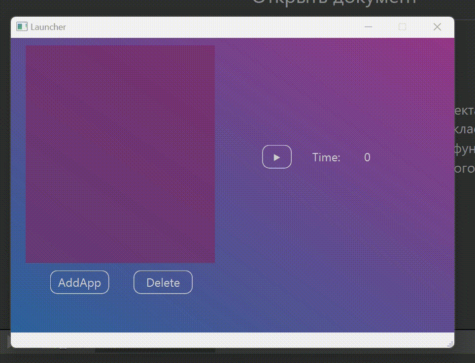

# **Launcher**
## **Example work**


___
*Explore file*
```C++
QString fileName = QFileDialog::getOpenFileName(this, "Выберите приложение",
                                                   QString(), "Исполняемые файлы (*.exe)");

    QString NameFile = QFileInfo(fileName).baseName();
```
___
## **Buttons** :computer:

*Add app* :white_check_mark:
```C++
itemListWidget = new QListWidgetItem();

    QFileIconProvider provider;
    QIcon icon;
    icon = provider.icon(QFileInfo(fileName));
    itemListWidget->setIcon(icon);
    itemListWidget->setText(NameFile);
    listWidget->addItem(itemListWidget);

    HideListWidget->addItem(fileName);
    //Подключаем базу данных
    db = QSqlDatabase::addDatabase("QODBC");//Драйвер SQL MS ACCESS
    db.setDatabaseName("DRIVER={Microsoft Access Driver (*.mdb, *.accdb)};FIL={MS Access};DBQ=Путь к базе данных");

    if (db.open())
    {
        qDebug()<<"Data base is open"<<Qt::endl;
        QSqlQuery query;
        query.prepare("INSERT INTO InfoGames (InfoGame, SrcGame) "
                           "VALUES (:InfoGame, :SrcGame)");
        query.bindValue(":InfoGame", NameFile);

        query.bindValue(":SrcGame", fileName);
        query.exec();
        db.close();
    }
    else qDebug()<<"Data base isn't open: "<<db.lastError();
```
___
*Button Delete* :no_entry:
```C++
if (db.open())
    {
        qDebug()<<"Data for delete is open"<<Qt::endl;
        QSqlQuery query;
        int index = listWidget->currentRow();
        qDebug()<<"number index = "<<index<<Qt::endl;
        //передаем по индексу элемент
        QListWidgetItem* item = listWidget->item(index);
        QListWidgetItem* itemSrcGames = HideListWidget->item(index);
        //Название удаляемого элемента
        QString NameToDelete = item->text();
        qDebug()<<NameToDelete<<Qt::endl;

        query.prepare("DELETE FROM InfoGames WHERE InfoGame=:InfoGame");
        query.bindValue(":InfoGame", NameToDelete);
        query.exec();

        delete item;
        delete itemSrcGames;
        db.close();

    }
    else qDebug()<<"Data base isn't open: "<<db.lastError();
```
___
*Launch* :link:
```C++
    startProcess = new QProcess(this);
    int index = listWidget->currentRow();
    if (index == -1) return;
    QString PathFile = HideListWidget->item(index)->text();
    if (PathFile.isEmpty()) return;

    startProcess->startDetached(PathFile);
    //timer->start(1);
    qDebug()<<startProcess->state()<<Qt::endl;
    if (startProcess->waitForFinished())
    {
        qDebug()<<"Программа завершилась"<<Qt::endl;
    }
```
___
___
## **MS Access DB** :calendar:
*Data base example* 
| ID            | InfoGame | SrcGame |
| :-------------: |:-------------:| :-----|
| 1     | LauncherPatcher |../Launcher/LauncherPatcher.exe |
| 2      | HogwartsLegacy     |   ../Win64/HogwartsLegacy.exe |
___
